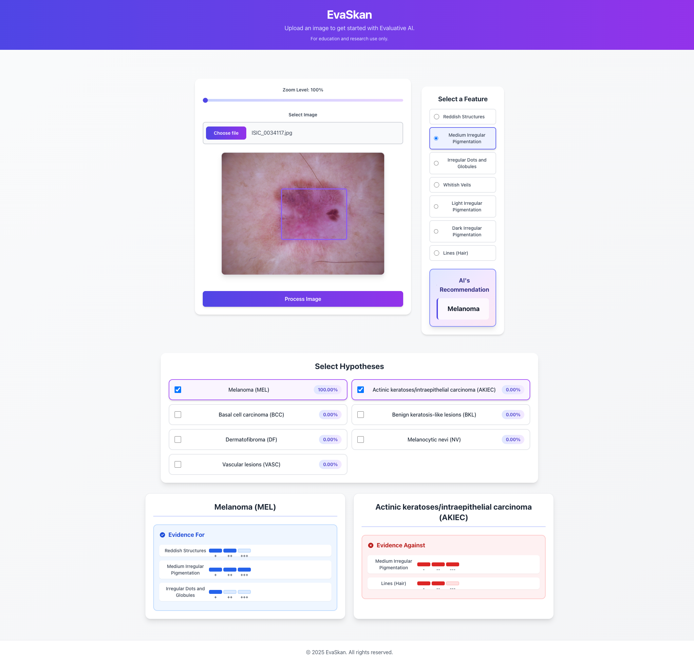

# EvaSkan (Evaluative Skin Cancer)

**Visual Evaluative AI** is a tool for decision support by providing positive and negative evidence for a given hypothesis. This tool finds high-level human concepts in an image and generates the Weight of Evidence (WoE) for each hypothesis in the decision-making process. We also apply this tool in the skin cancer domain by building a web-based application that allows users to upload a dermatoscopic image, select a hypothesis and analyse their decisions by evaluating the provided evidence.

By applying this tool, we build a web-based application called **EvaSkan** to evaluate dermatoscopic images. Users can select a hypothesis and the application will generate positive/negative evidence for that particular hypothesis.



## Features

EvaSkan provides an interactive interface for analysing dermatoscopic images with the following key features:

### 1. Zoom In/Out
- Use the zoom controls to examine dermatoscopic images in detail.

### 2. Feature Selection
- **Concept-Based Features**: Select from automatically detected high-level human-interpretable concepts
- **Visual Highlighting**: Selected features are highlighted on the image.

### 3. Hypothesis Selection
- View different hypotheses and their probability distribution returned by the AI. AI's Recommendation is the hypotheses with the highest probability.
- The system provides evidence corresponding to your selected hypothesis.
- Compare evidence across different hypotheses to understand differential diagnoses.

### 4. Evidence Visualization
- **Weight of Evidence (WoE)**: View positive and negative evidence for the selected hypothesis
  - Positive WoE: Evidence supporting the hypothesis
  - Negative WoE: Evidence against the hypothesis
- **Strength of Evidence**: WoE values are presented with strength categories (Not worth mentioning, Substantial, Strong, Decisive).

## Setup
### Backend Setup
```
# Install Python 3.12.3 using pyenv
pyenv install 3.12.3

# Create a virtual environment
pyenv virtualenv 3.12.3 py3.12.3

# Activate the virtual environment
pyenv activate py3.12.3

# Install dependencies
pip3 install -r requirements.txt
```

### Frontend Setup
```
# Download and install nvm
curl -o- https://raw.githubusercontent.com/nvm-sh/nvm/v0.40.3/install.sh | bash

# Reload shell configuration (or restart terminal)
. "$HOME/.nvm/nvm.sh"

# Install Node.js v22
nvm install 22

# Verify installation
node -v  # Should print "v22.17.0" or higher
npm -v   # Should print "10.9.2" or higher

# Install dependencies
cd frontend
npm install
```

### Environment on HPC
```
module load GCCcore/13.3.0
module load foss/2024a CUDA/12.5.1
module load Python/3.12.3
```


## Code structure
```
evaskan-demo/
├── backend/                    # FastAPI backend server
│   ├── main.py                 # FastAPI application entry point
│   ├── model.py                # ML model loading and prediction
├── frontend/                   # React frontend application
│   ├── public/                 # Public assets
│   ├── src/                            
│   │   ├── App.js              # Main React component
│   │   ├── components/         # React components
│   │   │   └── ImageUploadComponent.js     
│   │   └── index.js            
│   └── package.json            # Frontend dependencies
├── ice/                        # Invertible Concept-based Explanations
│   ├── channel_reducer.py     
│   ├── explainer.py            
│   ├── model_wrapper.py        
│   └── utils.py                
├── preprocessing/              # Data preprocessing utilities
│   ├── data_utils.py           
│   └── initdata.py             
├── save_model/                 # Saved model artifacts
│   ├── ICE_concept_*.sav       # Trained ICE concept model
│   ├── ICE_Exp_*.sav           # ICE explainer model
│   ├── ICE_woeexplainer_*.sav  # WoE explainer model
├── test_data/  
├── woe/                        # Weight of Evidence implementation
│   ├── explainers.py           
│   ├── woe.py                  
│   └── woe_utils.py            
├── analyze_test_images.py      # Check accuracy of test data
├── params.py                   # Global configuration parameters
└── classifiers.py              # Classifier implementations
└── requirements.txt            # Backend Python dependencies
```

## Usage

### Run the code
```
# Run FastAPI server
cd backend
python main.py

# Run React frontend
cd frontend
npm start
```

### Folder `save_model`
Models in save_model is trained by using the script `reproducibility/script/evaskan.sh` in repo [EvaluativeAI](https://github.com/thaole25/EvaluativeAI).

You can download pre-trained models [here](https://doi.org/10.5281/zenodo.17373187).

### Test images
Some test images can be found in `test_data/`. The images are taken from [HAM10000 dataset](https://www.kaggle.com/datasets/kmader/skin-cancer-mnist-ham10000).

### Weight of Evidence Guidelines
The table provides rule-of-thumb guidelines to explain the correlation between Weight of Evidence and Strength of Evidence (Copied from [here](https://github.com/dmelis/interpretwoe/blob/master/notebooks/WoE_UserStudy_Tutorial.ipynb))

| Weight of Evidence Score | Odds Ratio (Interp. 1) $=$ Probability Ratio (Interp. 2)  | Strength of Evidence |
| -------------   |:-------------:         |  -----:|
| $0$ to  $1.15$  | $1$ to $3$          | Not worth mentioning |
| $1.15$ to $2.3$ | $3$ to $10$   | Substantial |
| $2.3$ to $4.61$ | $10$ to $100$ | Strong |
| $>4.61$         | $> 100$       | Decisive |

## Paper
```
@article{le2024visual,
  title={Visual Evaluative AI: A Hypothesis-Driven Tool with Concept-Based Explanations and Weight of Evidence},
  author={Le, Thao and Miller, Tim and Zhang, Ruihan and Sonenberg, Liz and Singh, Ronal},
  journal={arXiv preprint arXiv:2407.04710},
  year={2024}
}
```

## References
- [WoE package](https://github.com/dmelis/interpretwoe)
- [ICE package](https://github.com/zhangrh93/InvertibleCE)

